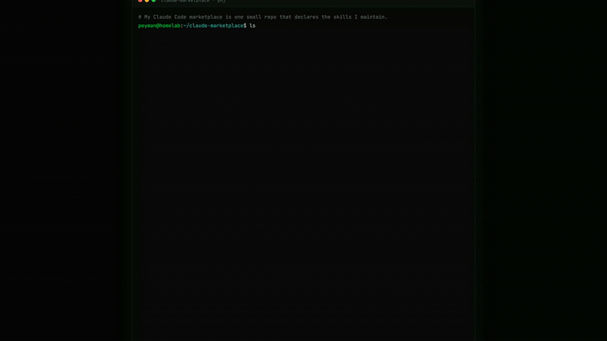

# claude-marketplace

Personal Claude Code plugin marketplace bundling the skills and plugins I maintain.



## Install on any machine (one-time)

```
/plugin marketplace add phj6688/claude-marketplace
/plugin install linear-issue-craft@phj
/plugin install forge-protocol@phj
/plugin install codestory@phj
/plugin install orchestrate-linear@phj
/plugin install backlog-ship@phj
```

## Pull updates everywhere

```
/plugin marketplace update phj
```

## Plugins included

| Plugin | Repo | Source shape |
|---|---|---|
| `linear-issue-craft` | [phj6688/linear-issue-craft](https://github.com/phj6688/linear-issue-craft) | `git-subdir` at `skill/` |
| `forge-protocol` | [phj6688/forge-protocol-skill](https://github.com/phj6688/forge-protocol-skill) | `github` (root `SKILL.md`) |
| `codestory` | [phj6688/codestory](https://github.com/phj6688/codestory) | `github` (`.claude-plugin/plugin.json` at root) |
| `orchestrate-linear` | [phj6688/orchestrate-linear](https://github.com/phj6688/orchestrate-linear) | `github` (`.claude-plugin/plugin.json` at root) |
| `backlog-ship` | [phj6688/backlog-ship](https://github.com/phj6688/backlog-ship) | `github` (`.claude-plugin/plugin.json` at root) |

## Auth notes

This marketplace repo is private. Manual `/plugin marketplace add` and `/plugin marketplace update` use your existing git credential helper (`gh auth login`, macOS Keychain, etc.).

For background auto-updates inside long-running Claude Code sessions (Routines, scheduled agents), set `GITHUB_TOKEN` or `GH_TOKEN` in the environment so the refresh can authenticate without an interactive prompt.

The underlying plugin repos are public, so once a plugin is installed, plugin-side updates don't need extra auth.
